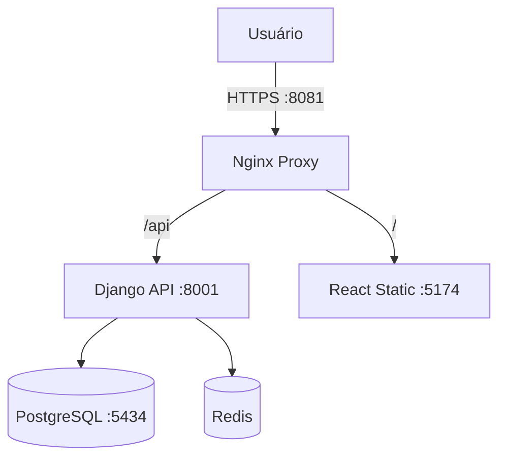

# Arquitetura do Sistema

## Visão Geral
O SGC (Sistema de Gestão de Compras) utiliza uma arquitetura monolítica modularizada no backend (Django) acoplada a um frontend SPA (Single Page Application) em React. Todo o sistema é orquestrado via Docker.

## 🏗️ Diagrama de Componentes

## 🧠 Backend (Django + Django Tenants)

O diferencial deste projeto é o uso da biblioteca **`django-tenants`**, permitindo uma arquitetura Multi-Tenant (Múltiplas Empresas) real, onde cada empresa (Tenant) possui seu próprio esquema isolado no banco de dados, mas compartilham a mesma instalação do software.

### Estrutura de Apps
*   **Shared Apps (Esquema `public`):**
    *   `tenants`: Gerencia os clientes (Empresas) e domínios.
    *   `users`: Usuários globais e autenticação.
*   **Tenant Apps (Esquemas `tenant1`, `tenant2`...):**
    *   `purchases`: O "coração" do sistema. Contém a lógica de Processos, Itens e Aprovações.
    *   `audit`: Logs de auditoria específicos por empresa.

## 💻 Frontend (React + Vite)

*   **Framework:** React 18+ com TypeScript.
*   **Build Tool:** Vite (para desenvolvimento rápido e build otimizado).
*   **Estilização:** CSS puro modularizado com Variáveis Globais (`variables.css`) para facilitar temas e manutenção.
*   **Comunicação:** Axios para requisições HTTP REST com interceptadores para tratamento de tokens JWT.

## 🔐 Segurança

1.  **Autenticação:** JWT (JSON Web Token) armazenado em Cookies `HttpOnly` para mitigar ataques XSS.
2.  **CSRF:** Proteção nativa do Django ativada e configurada para confiar nas origens do Frontend.
3.  **Proxy Reverso:** Nginx atua como barreira de entrada, gerenciando SSL e cabeçalhos de segurança.
